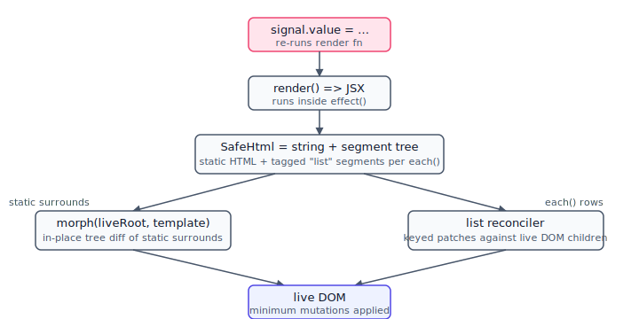

# kerf — orientation for new developers

> One-pager. **Hard cap: 500 words.** Assumes you've used a reactive UI library (React, Vue, Solid). The `check-requirements-against-code` skill keeps this in sync.

## Mental model

kerf is **signals + a DOM-string render + a morph diff**. There is no virtual DOM, no compiler, no fiber tree, no scheduler.

`mount(rootEl, () => jsx)` runs your render function inside an `effect()` from `@preact/signals-core`. The render function returns a `SafeHtml` — an HTML string for static markup, plus structured "list" segments where `each()` was called. On a signal write, the effect re-fires; `morph()` reconciles the static parts against the live DOM in place; the keyed list reconciler patches each `each()` list against its live children in O(changes). Coming from React: there is no in-memory tree to diff — kerf re-reads the live DOM and writes only what changed.

One tier below: a signal handed *itself* into a JSX hole (`class={sig}`) binds that node directly — later writes update it with no render re-run.

## Where to look first

- **Public API**: `src/index.ts` + `docs/8-api-reference.md`.
- **Render wiring / scheduling**: `src/mount.ts` — owns the effect and the dispatch to morph + list reconciler + binding wiring.
- **Static-element diff bugs** (attributes, text, focus preservation, `data-morph-*`): `src/morph.ts`.
- **Keyed-list bugs** (rows not moving, focus loss, duplicate keys): `src/list-reconcile.ts` and its siblings — `-snapshot` (default LIS path), `-granular` (the `arraySignal` patch path), `-inplace` / `-fast-paths` (fast paths), `-focus`.
- **Fine-grained bindings**: `src/bindings.ts` — marker-in-string wiring, global + per-row scopes.
- **Reactive primitives**: `src/reactive.ts` (signals-core re-export), `src/store.ts` (`defineStore`), `src/array-signal.ts`.
- **Event handlers**: never inline `onClick={fn}` — the JSX runtime renders strings and throws. Use `delegate(rootEl, 'click', selector, handler)` (`src/delegate.ts`).
- **Opting a subtree out of the diff**: `data-morph-skip` / `data-morph-skip-children` / `data-morph-preserve` on the host. See `docs/4-render.md` §4.3.
- **No-build authoring**: the `html` tagged template (`kerfjs/html`, `src/html.ts`) — JSX-identical semantics, no transform.

## What surprises React people

- **JSX renders to strings, not DOM nodes.** Passing an element as a child throws. `toElement()` is the one-shot string-to-Element bridge.
- **Components are plain functions.** `<MyComponent props />` calls `MyComponent(props)` and uses the returned JSX — no hooks, no lifecycle, no per-instance state. State lives in module-scope signals or stores.
- **Lists require `id` or `data-key` per row.** Without one, rows match positionally; focus and selection swap on insert/delete.
- **No synthetic event system.** You opt into delegation via `delegate()`.

## Conventions

One coherent concern per file, one primary export per file, ESM-only, kebab-case filenames. Module-level mutable state is confined to three documented spots (`store.ts:REGISTRY`, `each.ts:context`, `bindings.ts:context`/`rowSink`). `npm run check` is the fast gate (lint + typecheck + tests + build + dist suites); `npm run check:full` adds Playwright. Coverage is enforced at 100% lines/functions/statements, 99% branches on `src/`. Ticket numbers (`KF-NN`) are local-only — always include a self-contained summary when referencing them. See `CLAUDE.md` § Hot Sheet integration.

## Deeper reading

`docs/1-overview.md` → `docs/15-no-build-example.md` (design); `docs/ai/usage-guide.md` (AI-first reference); `CLAUDE.md` (canonical agent doc).
