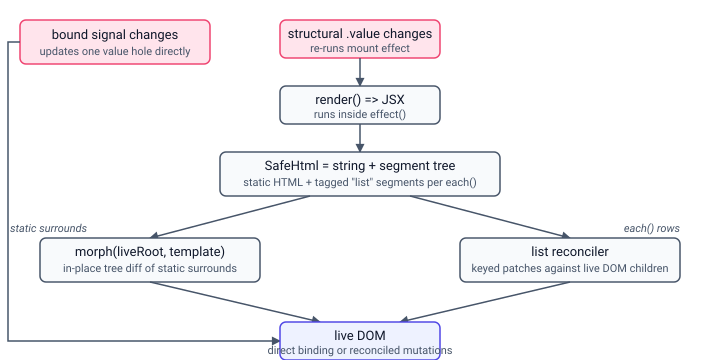

# kerf — orientation for new developers

> One-pager. **Hard cap: 500 words.** Assumes experience with a reactive UI library. The `check-requirements-against-code` skill keeps this synchronized.

## Mental model

kerf is **signals + DOM-string rendering + a morph diff**. There is no virtual DOM, compiler, fiber tree, or scheduler.

`mount(rootEl, () => jsx)` runs your render function inside an `effect()` from `@preact/signals-core`. It returns `SafeHtml`: static HTML plus structured list segments from `each()`. Pass a signal itself into a text or attribute hole and its binding updates that node directly, without re-running the render. Read `.value` when structure depends on it; that write re-fires the effect, `morph()` reconciles static parts in place, and the keyed list reconciler updates live children. Coming from React: there is no in-memory tree to diff — kerf reads live DOM and writes only what changed.

## Where to look first

- **Public API**: `src/index.ts` + `docs/8-api-reference.md`.
- **Render wiring / scheduling**: `src/mount.ts` — owns the effect and the dispatch to morph + list reconciler + binding wiring.
- **Static-element diff bugs** (attributes, text, focus preservation, `data-morph-*`): `src/morph.ts`.
- **Keyed-list bugs** (rows not moving, focus loss, duplicate keys): `src/list-reconcile.ts` and its siblings — `-snapshot` (default LIS path), `-granular` (the `arraySignal` patch path), `-inplace` / `-fast-paths` (fast paths), `-focus`.
- **Fine-grained bindings**: `src/bindings.ts` — marker-in-string wiring, global + per-row scopes.
- **Reactive primitives**: `src/reactive.ts` (signals-core re-export), `src/store.ts` (`defineStore`), `src/array-signal.ts`.
- **Event handlers**: never inline `onClick={fn}` — the JSX runtime renders strings and throws. Use `delegate(rootEl, 'click', selector, handler)` (`src/delegate.ts`).
- **Opting a subtree out of the diff**: `data-morph-skip` / `data-morph-skip-children` / `data-morph-preserve` on the host. See `docs/4-render.md` §4.3.
- **No-build authoring**: the `html` tagged template (`kerfjs/html`, `src/html.ts`) — JSX-identical semantics, no transform.
- **Companion utilities**: `kerfjs/{actions,async,attach,list,overlay,remount,router,scope,timing}` map to the same-named `src/*.ts` files.
- **UI components**: `ui/src/` + `docs/21-ui-package.md` — `@kerfjs/ui` and its UX catalog.

## What surprises React people

- **JSX renders to strings, not DOM nodes.** Passing an element as a child throws. `toElement()` is the one-shot string-to-Element bridge.
- **Components are plain functions.** `<MyComponent props />` calls `MyComponent(props)` and uses the returned JSX — no hooks, no lifecycle, no per-instance state. State lives in module-scope signals or stores.
- **Lists require `id` or `data-key` per row.** Without one, rows match positionally; focus and selection swap on insert/delete.
- **No synthetic event system.** You opt into delegation via `delegate()`.

## Conventions

One concern and primary export per file; ESM-only. Mutable module state is limited to `store.ts:REGISTRY`, `each.ts:context`, `dev-hooks.ts:devHooks`, and `bindings.ts:context`/`rowSink` (see CLAUDE.md rule 5; enforced by `npm run check:design-rule-5`). `npm run check` covers lint, types, tests, build, and dist; `check:full` adds Playwright. Coverage: 100% lines/functions, 99.5% statements, 98.5% branches. `KF-NN` tickets are local-only; include a self-contained summary.

## Deeper reading

`docs/1-overview.md` → `docs/25-ticket-timing.md`; `docs/ai/usage-guide.md`; `CLAUDE.md`.
