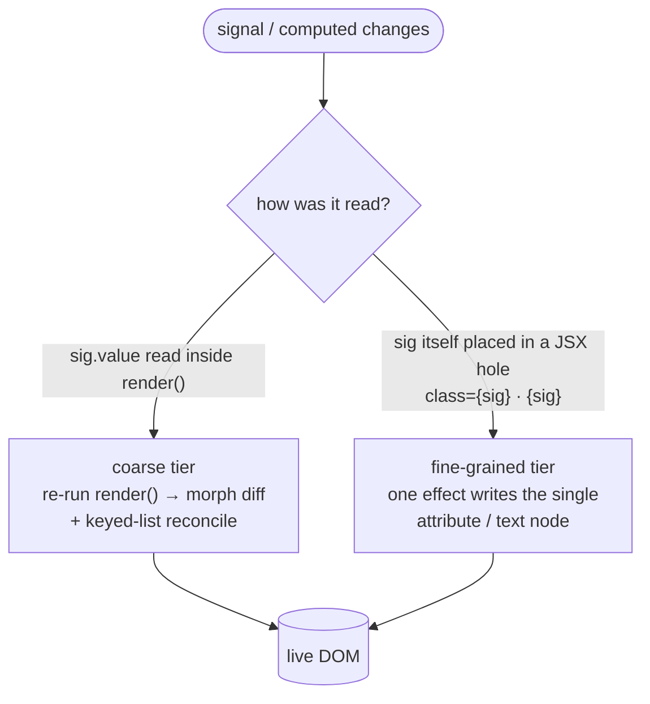
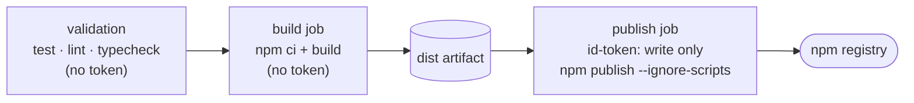

# Technical Changelog — v0.16.0 → v1.0.0

**Range:** `v0.16.0` (ae48b74) … `HEAD` (pre-1.0.0) · 26 commits.
**Size (product code only):** **+2,641 / −225** — `src` runtime + sub-packages + tests + bench. The raw diff (+3,704 / −358 across 88 files) is inflated by docs, `site/`, generated `ai/`+`assets`, and agent/skill scaffolding; the single biggest bucket is **tests (+1,051)**, then bench (+761), then `src` runtime (+829 incl. `src/utils`).
**Theme:** one new runtime tier (fine-grained signal bindings), a deep security-hardening pass across the escaping/URL surface, supply-chain hardening of the release pipeline, and a shift to official upstream benchmark numbers. **The public API is unchanged** — `src/index.ts` exports and the `package.json` subpaths are byte-identical to v0.16.0, so the whole binding feature is additive *behavior* on the existing JSX surface, not a new export. Sole runtime dependency (`@preact/signals-core`) unchanged; barrel measures ~12.4 KB gzipped at HEAD.

> Version is still `0.16.0` at HEAD; the bump to `1.0.0` lands at release. This report covers the work that qualifies the 1.0.

---

## 1. Runtime — Fine-grained signal bindings (headline)

`KF-294` (spike, milestones 1–2b) · `KF-297`–`KF-299` · new `src/bindings.ts` (383 LOC), `+156` to `jsx-runtime.ts`, `+61` to `mount.ts`.

Hand a `Signal`/`computed` **itself** (not `.value`) into a JSX attribute (`class={sig}`) or text hole (`{sig}`) inside a `mount()`, and kerf binds that hole directly: when the signal changes, only that node updates — the render function does **not** re-run and the list reconciler does **not** walk. This adds a fourth, finest update tier beneath the coarse render effect.

- Works in static content **and** inside `each()` rows on both the snapshot and `arraySignal` (granular) paths; a bound row's effect lifetime tracks its row node (reorder is free, removal tears the binding down).
- Row-binding create cost cut (`3e72c1d`): the common `<tr class={sig}>` row now wires with one `getAttribute` + an allocation-free id check — no `querySelectorAll`, no `Map`, no comment-subtree walk (built lazily only when a descendant/text hole needs them), and `bindAttr` returns a bare id string instead of a per-attr object. (The spike commit reports create-path overhead dropping ~1.65× → ~1.15×; that figure is from the commit, not reproduced here.)
- **Opt-in / non-breaking:** passing a raw signal into JSX previously threw; non-signal holes stringify exactly as before. SSR / `SafeHtml.toString()` snapshots the current value and emits no markers.
- Coordination uses a **reserved in-band marker namespace** (`data-kfb`/`data-kfbrow`, comments `kfb:`/`kfbr:`/`kf-list:`) — now documented as reserved (`KF-314`), since consumer markup or `raw()` could otherwise collide with a binding id.

## 2. Security hardening — escaping & URL surface

A systematic pass closing injection vectors on both the static serializer and the new bound path (shared implementations, so both tiers are covered):

| Area | Change | Tickets |
|---|---|---|
| **URL screen** | Sees through control-char/whitespace scheme obfuscation (`java\tscript:`); `data:` screened **by subtype** (script-capable docs dropped, inert media pass, unknown fails closed); `<object data>` screened | `KF-304/311/312`, `KF-297` |
| **Attribute names** | Validated against a safe shape → **throws** on spread-injection keys (`{...untrusted}`); any `on*` name rejected (string *or* function, any case) on both static and **bound** paths | `KF-306`, `KF-322` |
| **Trust boundary** | `toElement()` / string-template `morph()` / `<iframe srcdoc>` signposted as trusted-input-only (same model as `innerHTML`/`raw()`); real-browser spec pins the execution boundary across Chromium/Firefox/WebKit | `KF-305/313/316`, `KF-315/321` |

New guards live in `src/utils/urlScreen.ts` (102 LOC) and `jsx-runtime.ts`; regression coverage in `tests/unit/bindings.test.ts` and `tests/browser/trusted-html-bridges.spec.ts`.

## 3. Supply-chain & CI hardening (release pipeline)

`KF-317`–`KF-319`, `KF-323`, `KF-324` — least-privilege OIDC + tamper isolation for the npm trusted-publishing flow.

Before: a single `npm-publish` job held `id-token: write` at workflow scope and ran `npm ci → build → publish` together. After — least privilege, tamper-isolated:

- **OIDC scoped to the publish job** (off workflow scope) so validation jobs running untrusted install scripts can't mint a publishing token (`KF-317`; Pages equivalent `KF-324`).
- **Build/publish split** — the token-holding job runs no build tools or install scripts (`KF-318`).
- **Actions pinned by SHA** (third-party `softprops`, then all first-party `actions/*`) + **Dependabot** to keep pins fresh; dist-regression gate added to the tag-release flow (`KF-319`, `KF-323`).

## 4. Benchmarking — official upstream source

`KF-291` — kerf is now a **merged upstream entry** in `krausest/js-framework-benchmark`, so it's measured on the reference machine alongside every competitor. New `bench/import-krausest.mjs` pulls those canonical numbers into the git-tracked `bench/results.{json,md}` (homepage `PerfTable` source); the local M1-Pro harness (`aggregate-results.mjs`) is now dev-only and writes gitignored `results.local.*` so it can't clobber the published snapshot. An interactive playground (`npm run bench:serve`) and two micro-benchmarks were added. Current numbers reflect kerf **v0.16.0** on reference hardware — in the competitive cluster (select-row 6.1 ms, swap 12.8 ms), trailing the compiled leaders on create/update by design (no compiler).

---

### Verification & footprint

100% line/function/statement coverage (99% branch) maintained · 674 unit/integration tests + browser suites green · site builds clean (47 pages). Every change carries doc updates across the numbered docs, `docs/ai/*` summaries, CHANGELOG, and the AI-assistant configs.
